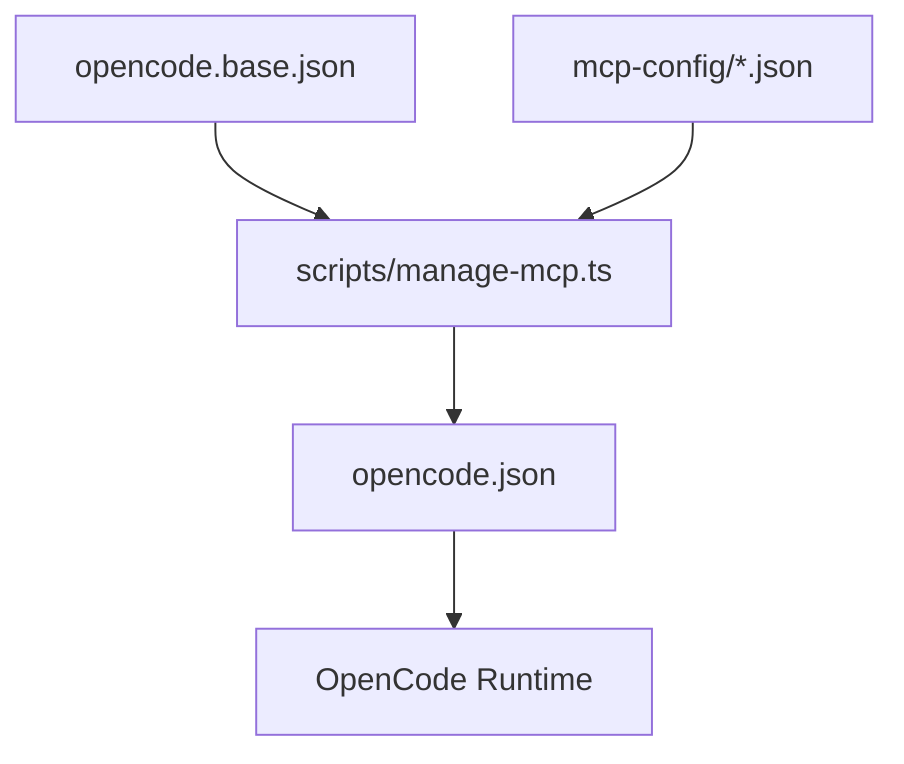

# OpenCode Configuration Agent Specification

## 1. Problem Statement
Previous attempts to configure OpenCode using general-purpose agents resulted in broken configurations. The root causes were:
- Lack of awareness of the generated configuration architecture (`opencode.json` vs `base` + `mcp-config`).
- Use of invalid keys (e.g., `description` in MCP objects) which caused OpenCode to crash.
- Direct editing of generated files leading to data loss.

## 2. Solution: OpenCode Configuration Manager
We have created a specialized agent (`opencode-config-manager`) designed to be the definitive expert on OpenCode configuration.

### Key Capabilities
- **Schema Awareness**: Knows valid keys and structure for `opencode.base.json` and MCP configs.
- **Build Process Integration**: Automatically runs the build script after changes.
- **Safety Checks**: Validates configuration before applying changes.
- **Troubleshooting**: Can diagnose and fix common configuration errors.

## 3. System Architecture

### Configuration Flow

### Components
1.  **`opencode.base.json`**: Contains core settings (agents, models, theme, provider).
2.  **`mcp-config/`**: Directory containing modular MCP server definitions.
3.  **`scripts/manage-mcp.ts`**: TypeScript script that merges source files into `opencode.json`.
4.  **`scripts/validate-config.ts`**: New validation script to check for errors before building.

## 4. Implementation Details

### Agent Definition
- **File**: `.opencode/agent/opencode-config-manager.md`
- **Name**: `opencode-config-manager`
- **Permissions**: Edit and Bash allowed (required for config management).

### Validation Script
- **File**: `scripts/validate-config.ts`
- **Usage**: `npx ts-node scripts/validate-config.ts`
- **Checks**:
    - Required fields in base config.
    - Invalid keys in MCP configs.
    - Missing required fields in MCP configs.

### Documentation
- **Troubleshooting**: `docs/TROUBLESHOOTING_CONFIG.md`
- **Agent Spec**: `docs/AGENT_SPEC_CONFIG.md` (this file)

## 5. Usage Guide

### How to use the Config Manager
Simply ask the agent to make configuration changes. It will handle the complexity of the build system.

**Examples:**
- "Add the 'brave' MCP server to the research category."
- "Change the default model to 'claude-3-opus'."
- "Fix my configuration errors."

### Manual Workflow (if needed)
1.  Edit `opencode.base.json` or `mcp-config/*.json`.
2.  Run `npx ts-node scripts/validate-config.ts`.
3.  Run `npx ts-node scripts/manage-mcp.ts build`.

## 6. Future Improvements
- Add Git integration to automatically commit config changes.
- Add rollback capability to the agent.
- Expand validation to cover all OpenCode schema constraints.
